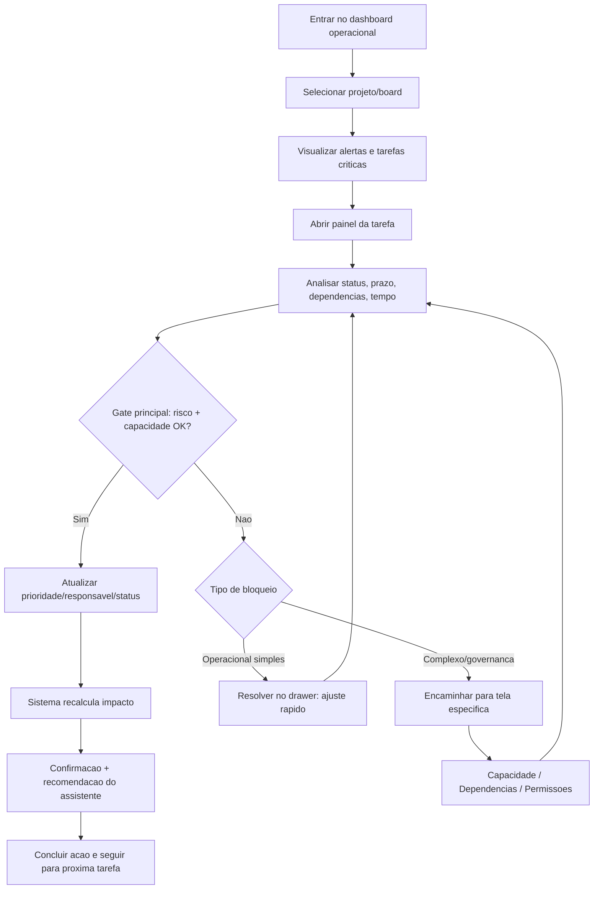
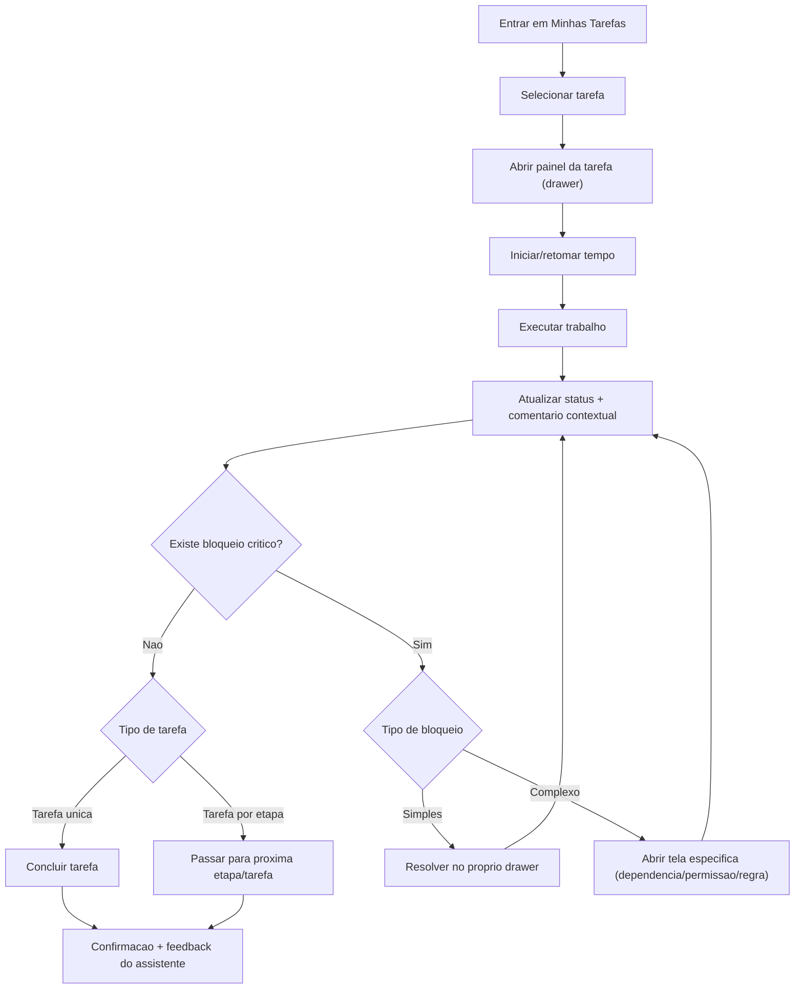
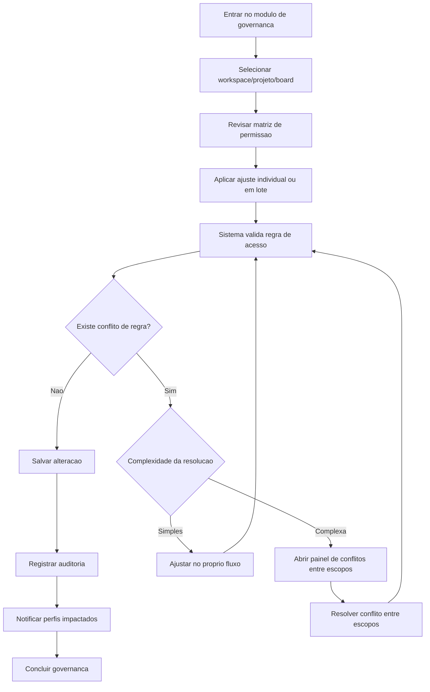

# UX Design Specification blackbeans-system

**Author:** kaue-ronald
**Date:** 2026-04-14

---

<!-- UX design content will be appended sequentially through collaborative workflow steps -->

## Executive Summary

### Project Vision

O `blackbeans-system` e um SaaS B2B de Work Management no estilo Monday.com, desenhado para agencias brasileiras que precisam integrar planejamento, execucao e governanca em uma unica operacao. A proposta de UX deve reduzir friccao entre monitoramento de entregas, tomada de decisao e controle operacional, com foco em clareza, rastreabilidade e velocidade de acao.

### Target Users

- **Usuario primario:** Coordenador de Operacoes (visao ponta a ponta de risco, prazo, carga e governanca).
- **Usuarios secundarios:** Admin/Superusuario (configuracao e seguranca), Gestor de Projetos/Contas (acompanhamento e prestacao de contas) e Colaborador (execucao e apontamento de tempo).
- **Contexto de uso:** ambiente operacional multi-projeto, multi-cliente, com alta mudanca de contexto e necessidade de resposta rapida.

### Key Design Challenges

- Traduzir a hierarquia completa (`Workspace > Portfolio > Project > Board > Group > Task`) em navegacao simples e previsivel.
- Equilibrar densidade de informacao (status, risco, tempo, auditoria, permissoes) com legibilidade e foco em acao.
- Reduzir sobrecarga cognitiva para o coordenador em cenarios de atraso, retrabalho e conflitos de prioridade.
- Garantir consistencia de UX entre visualizacoes de lista, kanban e timeline sem perder contexto operacional.

### Design Opportunities

- Criar experiencia orientada a decisao para o coordenador, com sinalizacao clara de risco e proximas acoes recomendadas.
- Tornar controle de tempo, comentarios, anexos e historico de atividade parte fluida do fluxo da tarefa, sem friccao adicional.
- Usar a central de notificacoes como motor de priorizacao operacional, nao apenas como inbox passiva.
- Transformar permissao e auditoria em mecanismos transparentes de confianca, com feedback claro de quem pode fazer o que e quando algo mudou.

## Core User Experience

### Defining Experience

A experiencia central do `blackbeans-system` gira em torno de um ciclo operacional continuo: **registrar horas na tarefa, atualizar status e manter comentarios contextuais** sem friccao. O sistema deve transformar a rotina do coordenador e do colaborador em um fluxo previsivel e rastreavel, reduzindo perda de contexto e retrabalho operacional.

A principal promessa de UX e que o trabalho diario deixa de ser “atualizar ferramenta” e passa a ser “tomar decisao com clareza”, com automacoes que antecipam risco e mantem o estado real da operacao sempre visivel.

### Platform Strategy

A V1 sera **web desktop-first**, otimizada para uso intensivo com mouse/teclado em ambiente operacional de escritorio.
A interface deve priorizar densidade de informacao acionavel, rapidez de navegacao entre niveis da hierarquia e baixa latencia de interacoes criticas (status, tempo, comentarios, priorizacao).

### Effortless Interactions

As interacoes que devem ser percebidas como “sem esforco” sao:

1. **Movimentacao de tarefa no fluxo com automacao de status**  
   Mover uma tarefa entre etapas deve ser natural e refletir automaticamente o estado correto quando aplicavel.

2. **Atualizacao automatica de status por prazo de cronograma**  
   Se a entrega prevista expirou sem conclusao, o status deve evoluir automaticamente para atrasado, com visibilidade imediata para operacao.

3. **Replanejamento automatico por dependencias**  
   Quando uma tarefa dependente atrasa, os prazos das tarefas conectadas devem ser recalculados automaticamente para preservar coerencia do plano.

4. **Controle inteligente de apontamento por horario comercial**  
   O registro de tempo deve poder ser travado por regra geral e/ou por colaborador; se o cronometro exceder a janela permitida, deve pausar automaticamente.

### Critical Success Moments

Os momentos que definem sucesso da experiencia sao:

- Quando o coordenador identifica, em segundos, **tarefas por colaborador** (a fazer e em aberto) sem consolidacao manual.
- Quando o coordenador enxerga **previsibilidade de horas disponiveis** para decidir com seguranca onde encaixar demandas atuais e futuras.
- Quando status, prazo e tempo permanecem coerentes automaticamente, reduzindo necessidade de “conferencia manual constante”.

### Experience Principles

- **Automacao orientada a realidade operacional:** o sistema atualiza estados criticos sem depender de lembranca do usuario.
- **Visibilidade acionavel por pessoa e capacidade:** a UX deve apoiar decisao de alocacao e priorizacao em tempo real.
- **Consistencia entre planejamento e execucao:** cronograma, dependencias e status devem contar a mesma historia.
- **Rastreabilidade sem friccao:** tempo, comentarios e historico devem ser parte natural do fluxo, nao uma carga extra.

## Desired Emotional Response

### Primary Emotional Goals

A experiencia do `blackbeans-system` deve gerar, como estado principal, **controle e clareza**. O usuario deve sentir que entende o que esta acontecendo na operacao, onde estao os riscos e quais decisoes precisam ser tomadas em seguida, sem depender de consolidacoes manuais paralelas.

### Emotional Journey Mapping

- **Descoberta/entrada no sistema:** usuario sente orientacao e leitura rapida do estado operacional.
- **Execucao diaria:** usuario sente fluidez e objetividade ao atualizar status, registrar tempo e comentar contexto.
- **Acompanhamento e decisao:** usuario sente controle sobre carga, prazos e dependencias.
- **Retorno recorrente ao produto:** usuario percebe consistencia e previsibilidade da operacao, reforcando confianca no sistema.

### Micro-Emotions

Micro-emocoes prioritarias para reforcar:
- **Confianca:** “os dados estao corretos e atualizados”.
- **Produtividade:** “consigo agir rapido sem trabalho burocratico”.
- **Senso de progresso:** “o trabalho esta avancando com visibilidade real”.
- **Calma operacional:** “mesmo com volume alto, consigo priorizar com clareza”.

Micro-emocoes a evitar:
- **Confusao**
- **Ansiedade**
- **Sensacao de falta de controle**

### Design Implications

- **Controle e clareza** -> dashboards e visoes com hierarquia clara, status legivel e prioridades explicitas.
- **Produtividade** -> interacoes de alta frequencia com baixo atrito (status, tempo, comentarios, mover tarefa).
- **Senso de progresso** -> feedback continuo de evolucao por colaborador, projeto e capacidade.
- **Risco de afetacao de produtividade em incidentes** -> quando houver atraso/conflito, o sistema deve sinalizar impacto com objetividade e encaminhar acao recomendada, em vez de apenas alertar problema.

### Emotional Design Principles

- **Visibilidade antes de complexidade:** mostrar o que importa primeiro para decisao.
- **Acoes com contexto:** toda acao operacional deve responder “o que mudou” e “qual impacto”.
- **Risco acionavel:** alertas devem vir com direcao pratica, nao so com sinal de perigo.
- **Confianca por consistencia:** manter linguagem, status e comportamento previsiveis em todo o fluxo.

## UX Pattern Analysis & Inspiration

### Inspiring Products Analysis

- **Monday**
  - **Forca principal:** visao operacional ampla com estrutura modular por contexto de trabalho.
  - **Licao para o produto:** permitir que o coordenador configure vistas e blocos sem perder consistencia da hierarquia operacional.
  - **Valor percebido:** sensacao de controle e clareza sobre multiplos fluxos em paralelo.

- **ClickUp**
  - **Forca principal:** barra de menu principal robusta e centralizadora da navegacao.
  - **Licao para o produto:** criar navegacao global estavel, com atalhos diretos para areas criticas (tarefas, capacidade, alertas, permissoes, logs).
  - **Valor percebido:** reducao de friccao para mudanca rapida de contexto.

- **Google Analytics**
  - **Forca principal:** apresentacao de dados com leitura progressiva e possibilidade de relatorios modulares.
  - **Licao para o produto:** dashboards com blocos configuraveis por objetivo operacional (prazo, retrabalho, tempo, capacidade) e drill-down por colaborador/projeto.
  - **Valor percebido:** decisoes orientadas por evidencia, nao por percepcao.

- **Google Chat**
  - **Forca principal:** comunicacao contextual simples e integracao com agenda.
  - **Licao para o produto:** comentarios e trocas por tarefa devem ser naturais, com possibilidade futura de sincronizar compromissos e marcos de cronograma.
  - **Valor percebido:** menos ruido de comunicacao e melhor coordenacao de prazos.

### Transferable UX Patterns

- **Navegacao**
  - Menu principal persistente com acesso rapido a modulos centrais.
  - Estrutura de navegacao por camadas (visao global -> detalhe operacional) sem quebrar contexto.
  - “Estado atual” sempre visivel (onde estou na hierarquia e no fluxo).

- **Interacao**
  - Configuracao modular de visualizacoes por papel.
  - Acoes de alta frequencia com baixo atrito (status, mover tarefa, registrar hora, comentar).
  - Alertas acionaveis com contexto e proximo passo sugerido.

- **Dados e leitura analitica**
  - Blocos de metrica modulares com filtros por tempo, colaborador e projeto.
  - Comparacao entre planejado vs realizado.
  - Relatorios reaproveitaveis por cenario operacional.

### Anti-Patterns to Avoid

- Menu inflado sem hierarquia de prioridade.
- Dashboards com excesso de metricas sem narrativa de decisao.
- Acoes criticas escondidas em multiplos cliques.
- Notificacoes sem contexto pratico ("alerta solto" sem impacto/acao).
- Automacoes que alteram estado sem transparencia explicavel ao usuario.

### Design Inspiration Strategy

**What to Adopt**
- Estrutura modular de visao operacional (inspirada em Monday).
- Navegacao principal forte e previsivel (inspirada em ClickUp).
- Dashboard orientado a leitura decisoria e relatorios modulares (inspirado em GA).
- Comunicacao contextual simples em torno da tarefa (inspirada em Google Chat).

**What to Adapt**
- Modularidade com limites para nao gerar complexidade excessiva para o coordenador.
- Menu principal adaptado a hierarquia da agencia, com prioridade por frequencia de uso.
- Relatorios moldados para operacao de entrega (nao marketing/analytics generico).

**What to Avoid**
- Customizacao sem governanca de padrao.
- Overload visual em paineis.
- Fluxos de comunicacao paralelos fora do contexto da tarefa.

## Design System Foundation

### 1.1 Design System Choice

A base de design system escolhida para o `blackbeans-system` e **Ant Design**, com uma camada de tematizacao orientada por tokens da marca existente.

A decisao privilegia o equilibrio entre velocidade de implementacao e consistencia operacional em interfaces densas, mantendo espaco para personalizacao visual controlada.

### Rationale for Selection

A escolha por Ant Design foi definida pelos seguintes fatores:

- **Equilibrio entre rapidez e identidade:** a biblioteca acelera entrega da V1 sem impedir aplicacao da identidade visual ja existente.
- **Aderencia ao perfil do produto:** o sistema demanda interfaces de operacao densas (tabelas, formularios, filtros, estados), onde Ant Design e robusto.
- **Preferencia explicita por estilo enterprise denso:** alinhamento direto com a direcao visual desejada.
- **Reducao de risco de consistencia:** componentes maduros e padroes consolidados diminuem variabilidade de UX ao longo dos modulos.

### Implementation Approach

A implementacao seguira uma estrategia em camadas:

1. **Fundacao de UI**
   - Adotar Ant Design como biblioteca principal.
   - Configurar tema global com tokens de cor, tipografia, espacamento e estados.

2. **Camada semantica de produto**
   - Traduzir guia de marca em tokens semanticos de UX (ex.: `primary`, `risk-high`, `surface-muted`, `text-strong`).
   - Definir regras de uso por contexto operacional (status, risco, prioridade, feedback).

3. **Componentes de dominio**
   - Criar wrappers reutilizaveis sobre Ant para padroes do negocio:
     - indicadores de status de tarefa;
     - badges de risco;
     - chips de capacidade;
     - tabelas operacionais;
     - itens de notificacao.
   - Garantir que fluxos criticos usem os mesmos blocos visuais e comportamentais.

4. **Qualidade e acessibilidade**
   - Validar contraste, navegacao por teclado e consistencia de estados interativos.
   - Aplicar checklist de UX QA para fluxos principais (tarefas, timeline, notificacoes, permissoes).

### Customization Strategy

A customizacao visual sera guiada por tres principios:

- **Marca com governanca:** personalizar tokens e estilo para refletir identidade sem fragmentar o sistema.
- **Clareza operacional primeiro:** priorizar legibilidade e sinalizacao acionavel sobre elementos decorativos.
- **Padronizacao evolutiva:** expandir componentes de dominio com regras claras para evitar divergencia entre telas e equipes.

## 2. Core User Experience

### 2.1 Defining Experience

A experiencia que define o `blackbeans-system` e o **Painel de Tarefa de Atualizacao Rapida**, onde o usuario executa em um unico fluxo as acoes operacionais mais frequentes: atualizar status, registrar tempo, adicionar comentario contextual e concluir proximo passo.

O diferencial e permitir que **coordenador e colaborador** realizem a mesma acao central com variacoes de profundidade:
- o colaborador foca em execucao rapida (status + tempo + contexto);
- o coordenador foca em decisao operacional (impacto em prazo, dependencia, risco e capacidade).

Se essa interacao for impecavel, o restante da UX herda consistencia, velocidade e confianca de dados.

### 2.2 User Mental Model

Os usuarios chegam com o modelo mental de operacao fragmentada (planilha + chat + ferramenta de tarefa), onde atualizar o trabalho custa tempo e exige repeticao de contexto.

No `blackbeans-system`, o modelo esperado passa a ser:
- **"A tarefa e meu centro de trabalho"**;
- **"Atualizar e rapido"**;
- **"O sistema me mostra impacto e proximo passo"**.

Pontos de expectativa por perfil:
- **Colaborador:** espera registrar progresso sem burocracia e sem perder foco da execucao.
- **Coordenador:** espera identificar risco e decidir rapidamente sem consolidacao manual.

Principais riscos de confusao que a UX deve evitar:
- duvida sobre o que e obrigatorio para concluir ou mover tarefa;
- falta de clareza sobre por que uma acao foi bloqueada;
- excesso de mensagens sem hierarquia de prioridade.

### 2.3 Success Criteria

A experiencia central sera considerada bem-sucedida quando:

- o usuario consegue atualizar a tarefa em poucos segundos sem trocar de tela;
- status, tempo e comentarios permanecem coerentes no mesmo fluxo;
- bloqueios criticos sao claros, justificaveis e orientados a resolucao;
- o sistema sinaliza automaticamente impacto de prazo/dependencia com recomendacao objetiva;
- o usuario sente que a ferramenta acelera a operacao em vez de adicionar trabalho.

Indicadores de sucesso:
- **Velocidade operacional:** tempo medio para atualizar tarefa reduzido de forma consistente.
- **Qualidade de registro:** menor volume de tarefas sem contexto minimo (status sem comentario/tempo quando obrigatorio).
- **Confianca da operacao:** reducao de inconsistencias entre status, cronograma e execucao real.

### 2.4 Novel UX Patterns

A base do fluxo usa **padroes estabelecidos** (painel lateral de detalhe, formularios inline, feedback de validacao), combinados com um diferencial de produto:

- **Padroes estabelecidos adotados:**
  - painel de tarefa (drawer) como area principal de acao;
  - edicao inline de campos criticos;
  - feedback imediato de sucesso/erro por acao.

- **Twist do produto (comportamento semi-novo):**
  - bloqueio inteligente de acoes criticas com explicacao operacional;
  - assistente explicito que informa impacto da alteracao e recomenda proximo passo;
  - variacao de densidade por perfil (execucao vs decisao) sem quebrar consistencia visual.

Nao exige reaprendizado completo: inova no encadeamento operacional e na inteligibilidade de impacto, mantendo interacoes familiares.

### 2.5 Experience Mechanics

**1. Initiation**
- O usuario abre a tarefa a partir de lista, kanban, timeline ou notificacao.
- A abertura ocorre no painel lateral de tarefa (sem sair do contexto da visao atual).

**2. Interaction**
- No painel, o usuario pode:
  - atualizar status;
  - iniciar/pausar/retomar apontamento;
  - registrar comentario contextual;
  - ajustar prioridade e campos operacionais essenciais.
- O sistema processa atualizacoes em tempo real e recalcula estados dependentes quando aplicavel.

**3. Feedback**
- Confirmacoes imediatas de acao bem-sucedida.
- Assistente explicito exibe:
  - impacto em prazo e dependencia;
  - risco gerado/reduzido;
  - recomendacao pratica de proxima acao.
- Em violacoes criticas, a acao e bloqueada com mensagem clara:
  - o que bloqueou;
  - por que bloqueou;
  - como desbloquear.

**4. Completion**
- O usuario conclui a interacao quando o painel mostra estado sincronizado (status/tempo/comentario).
- O resultado esperado e dupla confianca:
  - **colaborador:** "atualizei rapido e corretamente";
  - **coordenador:** "consigo decidir agora com base em dados atuais".
- O fluxo seguinte sugerido e orientado pelo assistente (ex.: revisar dependente em risco, redistribuir prioridade, validar capacidade).

## Visual Design Foundation

### Color System

A fundacao de cor do `blackbeans-system` sera baseada nas cores oficiais da marca Black Beans, com mapeamento semantico para uso em interface enterprise densa.

**Brand Core (extraido do manual):**
- `Brand Primary`: `#DA9330`
- `Neutral 500`: `#B1B0B1`
- `Neutral 900`: `#141312`
- `Neutral 50`: `#F4F0ED`

**Semantic Mapping (Produto):**
- `Primary / CTA`: `#DA9330`
- `Primary Hover`: tom ~8% mais escuro de `#DA9330`
- `Primary Active`: tom ~14% mais escuro de `#DA9330`
- `Background Base`: `#F4F0ED`
- `Surface Elevated`: `#FFFFFF`
- `Text Primary`: `#141312`
- `Text Secondary`: `#B1B0B1`
- `Border Default`: mistura entre `#B1B0B1` e `#F4F0ED` para separacoes sutis

**Cores de estado (funcionais, complementares a marca):**
- `Success`: verde de sistema (ex.: faixa `#2E7D32`)
- `Warning`: ambar alinhado ao tom da marca (baseado em `#DA9330`)
- `Error`: vermelho de alto contraste (ex.: faixa `#C62828`)
- `Info`: azul de sistema para mensagens informativas

A estrategia visual prioriza contraste funcional e leitura rapida de status, mantendo a assinatura visual da marca no eixo principal de acao e identidade.

### Typography System

A tipografia do produto seguira o guideline informado:

- **Titulos:** `Briston Typeface`
- **Texto/interface:** `Roboto` (family)

**Hierarquia tipografica sugerida:**
- `H1` (pagina): Briston, peso forte, uso pontual
- `H2` (secao): Briston, peso medio/forte
- `H3` (subsecao/componente): Briston ou Roboto semibold conforme densidade
- `Body M` (padrao): Roboto Regular
- `Body S` (metadados): Roboto Regular
- `Label/UI` (campos, filtros, badges): Roboto Medium
- `Caption` (auxiliar): Roboto Regular

**Diretrizes de uso:**
- Briston para reforco de identidade em pontos estruturais (cabecalhos e titulos de contexto).
- Roboto como fonte principal de leitura e operacao para garantir legibilidade em telas densas.
- Priorizar variacao de peso mais do que variacao agressiva de tamanho, mantendo consistencia visual.

### Spacing & Layout Foundation

Como definido, a interface segue perfil **mais denso (enterprise)** com grid base de **8px**.

**Sistema de espacamento (8pt grid):**
- Unidades: `4, 8, 12, 16, 24, 32, 40, 48`
- Espacamento interno de componentes: base em `8/12/16`
- Distancia entre blocos de secao: `24/32`
- Respiro estrutural de pagina: `24+` em desktop

**Estrutura de layout:**
- Navegacao persistente + area de conteudo principal.
- Uso de painel lateral de tarefa (drawer) como padrao de acao rapida sem perda de contexto.
- Densidade controlada por hierarquia visual: informacao critica primeiro, detalhe sob demanda.
- Grid de colunas para dashboards e listas, priorizando leitura analitica e escaneabilidade.

**Principios de layout:**
- Clareza operacional acima de estetica decorativa.
- Reducao de mudanca de contexto em tarefas de alta frequencia.
- Consistencia entre lista, kanban, timeline e painel de tarefa.

### Accessibility Considerations

Ainda nao ha exigencia formal definida, mas a base sera preparada para evolucao sem retrabalho:

- Adotar contraste forte entre texto e fundo em todos os fluxos principais.
- Garantir estados de foco visiveis em componentes interativos.
- Evitar dependencia exclusiva de cor para comunicar estado (sempre combinar com icone/label).
- Manter tamanhos e pesos legiveis em ambiente denso.
- Planejar design tokens para futura conformidade formal com WCAG AA.

## Design Direction Decision

### Design Directions Explored

Foram exploradas 6 direcoes visuais para o `blackbeans-system`, com variacoes de hierarquia de informacao, peso visual, uso da paleta da marca, navegacao e destaque de assistente operacional.

As direcoes mais relevantes para decisao final foram:
- **Direcao 1 (Focused Ops):** melhor estrutura para operacao densa e centralidade do painel de tarefa.
- **Direcao 2 (Analitica Modular):** melhor expressao da identidade de marca com contraste funcional consistente.

### Chosen Direction

A direcao escolhida e uma **combinacao orientada pela Direcao 1**, incorporando o tratamento de cor e contraste percebido como superior na **Direcao 2**.

Definicao objetiva:
- **Base estrutural e de interacao:** Direcao 1
- **Linguagem cromatica de referencia:** Direcao 2
- **Resultado esperado:** operacao densa com alta clareza, painel de tarefa como centro de acao e identidade visual mais evidente da marca.

### Design Rationale

A escolha foi feita porque:
- Direcao 1 oferece o melhor encaixe para o fluxo principal do produto (atualizacao rapida em painel de tarefa).
- Direcao 1 equilibra melhor densidade enterprise e legibilidade para decisao operacional.
- Direcao 2 representa melhor a paleta da marca (preto/caramelo/cinza) sem prejudicar contraste de estados e leitura funcional.
- A combinacao reduz risco de comprometer produtividade enquanto reforca diferenciacao visual da Black Beans.

### Implementation Approach

A implementacao seguira estes passos:
1. Aplicar o layout-base da Direcao 1 como padrao para vistas operacionais.
2. Ajustar tokens de cor e contraste com referencia da Direcao 2.
3. Validar estados funcionais (success/warning/error/info) sobre fundo de marca para manter legibilidade.
4. Consolidar o painel de tarefa como eixo central da experiencia em lista, kanban e timeline.
5. Revisar consistencia visual em dashboard, tarefas e central de alertas antes da fase de detalhamento de fluxos.

## User Journey Flows

### Jornada 1 - Coordenador de Operacoes (Risco + Capacidade como Gate)

Objetivo: permitir decisao rapida e segura sobre priorizacao, redistribuicao e mitigacao de atraso usando risco e capacidade como criterio principal.

Pontos-chave de UX:
- Gate de decisao obrigatorio por risco e capacidade.
- Assistente explicito sempre sugere proxima acao.
- Recuperacao hibrida: drawer primeiro, escalando para tela especializada quando necessario.

### Jornada 2 - Colaborador (Execucao Diaria com Branch por Tipo de Tarefa)

Objetivo: atualizar tarefa com velocidade, mantendo coerencia de status, tempo e contexto.

Pontos-chave de UX:
- Fluxo rapido centrado no drawer.
- Branch explicito entre tarefa unica e tarefa por etapas.
- Bloqueios com mensagem clara: o que bloqueou, por que e como resolver.

### Jornada 3 - Admin/Superusuario (Governanca e Permissoes)

Objetivo: garantir seguranca operacional e rastreabilidade sem travar a operacao diaria.

Pontos-chave de UX:
- Toda alteracao relevante gera trilha de auditoria.
- Conflitos de permissao sao explicaveis e rastreaveis.
- Recuperacao hibrida tambem aplicada em governanca.

### Journey Patterns

**Padroes de navegacao**
- Entrada por contexto operacional (dashboard, minhas tarefas, governanca).
- Acao principal centralizada em painel lateral (drawer).
- Escalonamento para telas especializadas apenas em casos complexos.

**Padroes de decisao**
- Gate explicito antes de acao critica.
- Regra de bloqueio com mensagem orientada a resolucao.
- Diferenciacao clara entre bloqueio simples e bloqueio complexo.

**Padroes de feedback**
- Confirmacao imediata para acao bem-sucedida.
- Assistente explicito com impacto + recomendacao.
- Proximo passo sugerido ao final de cada interacao.

### Flow Optimization Principles

- **Velocidade com controle:** minimizar cliques para tarefas frequentes sem perder governanca.
- **Drawer-first:** resolver no contexto atual sempre que possivel.
- **Escalonamento inteligente:** telas especificas apenas para conflitos de alta complexidade.
- **Consistencia de linguagem:** mesmos termos de status, bloqueio e impacto em todos os modulos.
- **Recuperacao orientada:** todo erro deve informar causa, impacto e acao recomendada.

## Component Strategy

### Design System Components

Com base na escolha de **Ant Design** como fundacao, os componentes base reutilizaveis para o `blackbeans-system` serao:

- Layout: `Layout`, `Sider`, `Header`, `Content`, `Grid`
- Navegacao: `Menu`, `Breadcrumb`, `Tabs` (quando necessario), `Dropdown`
- Dados e listagem: `Table`, `List`, `Tag`, `Badge`, `Tooltip`
- Formularios e entrada: `Form`, `Input`, `Select`, `DatePicker`, `Checkbox`, `Radio`, `Switch`
- Feedback e estado: `Alert`, `Message`, `Notification`, `Result`, `Progress`, `Skeleton`, `Spin`
- Sobreposicao: `Drawer`, `Modal`, `Popover`
- Acao: `Button`, `Segmented`, `Pagination`

Esses componentes cobrem a maior parte da estrutura visual e interacoes padrao, reduzindo custo de implementacao e aumentando consistencia.

### Custom Components

Os componentes customizados abaixo foram definidos para cobrir lacunas funcionais do produto e reforcar os fluxos criticos da operacao.

### TaskDrawerPanel

**Purpose:** centralizar a operacao da tarefa em um unico fluxo de alta frequencia.  
**Usage:** aberto a partir de lista, kanban, timeline e notificacoes.  
**Anatomy:** cabecalho de contexto + corpo unico com scroll + acoes fixas de status/tempo/comentario.  
**States:** default, loading, bloqueio critico, sincronizando, sucesso, erro.  
**Variants:** compacta (colaborador) e expandida (coordenador).  
**Accessibility:** foco inicial no titulo, navegacao por teclado entre secoes, leitura semantica dos blocos.  
**Content Guidelines:** priorizar status, prazo, tempo e comentario acima de metadados secundarios.  
**Interaction Behavior:** atualizacao inline, feedback imediato e retorno de impacto do assistente.

### OperationalStatusBadge

**Purpose:** padronizar leitura de estado operacional de tarefas/projetos.  
**Usage:** tabelas, cards, drawer, timeline e notificacoes.  
**Anatomy:** label + cor semantica + icone opcional + tooltip de contexto.  
**States:** normal, em atencao, critico, concluido, bloqueado.  
**Variants:** `sm`, `md`, `pill`, `outlined`.  
**Accessibility:** nao depender apenas de cor; incluir texto e icone.  
**Content Guidelines:** usar labels curtos e consistentes com glossario de status.  
**Interaction Behavior:** hover revela explicacao e impacto.

### CapacityChip

**Purpose:** exibir capacidade disponivel/comprometida por colaborador/time.  
**Usage:** dashboards, atribuicao de tarefa, validacao de gate risco+capacidade.  
**Anatomy:** nome da entidade + valor (h) + semaforo visual + tendencia opcional.  
**States:** ocioso, equilibrado, sobrecarregado, indisponivel.  
**Variants:** por pessoa, por time, por periodo.  
**Accessibility:** valor numerico sempre visivel; contraste reforcado em estados criticos.  
**Content Guidelines:** mostrar janela temporal associada (hoje/semana/sprint).  
**Interaction Behavior:** clique abre detalhe de distribuicao de carga.

### NotificationActionItem

**Purpose:** transformar notificacao em acao objetiva, nao apenas informativa.  
**Usage:** central de notificacoes e alertas no dashboard.  
**Anatomy:** titulo, contexto, severidade, recomendacao, CTA primario, CTA secundario.  
**States:** nao lida, lida, executada, expirada, suprimida.  
**Variants:** informativa, alerta, critica.  
**Accessibility:** ordem de leitura logica, CTA com rotulos claros e foco visivel.  
**Content Guidelines:** sempre incluir “o que mudou” + “o que fazer agora”.  
**Interaction Behavior:** executa acao direta ou abre contexto no drawer/tela especializada.

### AuditTimelinePanel

**Purpose:** fornecer trilha de auditoria navegavel para governanca e analise de incidente.  
**Usage:** modulo administrativo, investigacao de conflito, revisao de alteracoes criticas.  
**Anatomy:** timeline cronologica + filtros (ator, escopo, tipo de evento) + detalhe expandivel.  
**States:** carregando, sem eventos, com eventos, filtro ativo, erro de consulta.  
**Variants:** compacta (preview) e detalhada (investigacao).  
**Accessibility:** eventos com ordem temporal semantica e navegacao por teclado.  
**Content Guidelines:** registrar quem, quando, o que mudou, escopo e impacto.  
**Interaction Behavior:** selecionar evento abre diff de permissao/estado quando aplicavel.

### AssistantRecommendationBox

**Purpose:** exibir recomendacao explicita de proxima acao no contexto da tarefa.  
**Usage:** sempre visivel no `TaskDrawerPanel`, com atualizacao dinamica por evento.  
**Anatomy:** status de recomendacao + explicacao curta + CTA recomendado + impacto esperado.  
**States:** neutro, recomendacao ativa, alerta, bloqueio, indisponivel.  
**Variants:** operacional, risco, capacidade, governanca.  
**Accessibility:** linguagem objetiva e CTA com foco prioritario por teclado.  
**Content Guidelines:** mensagem curta, acionavel e contextualizada.  
**Interaction Behavior:** recomenda e permite executar acao imediata quando possivel.

### PermissionConflictResolver

**Purpose:** resolver conflitos de permissao entre escopos hierarquicos com seguranca e rastreabilidade.  
**Usage:** fluxo de governanca quando regra herdada conflita com regra especifica.  
**Anatomy:** painel de conflito + origem da regra + impacto + opcoes de resolucao + confirmacao auditavel.  
**States:** conflito detectado, analise, resolucao selecionada, aplicacao, erro, sucesso.  
**Variants:**  
- **Wizard passo-a-passo** para conflitos criticos (orientado e seguro)  
- **Tabela rapida** para ajustes em lote (eficiencia administrativa)
**Accessibility:** cada passo/linha com descricao explicita do impacto da decisao.  
**Content Guidelines:** evitar termos ambiguos; explicitar escopo (`workspace > portfolio > project > board`).  
**Interaction Behavior:** toda alteracao confirma impacto e gera registro de auditoria.

### Component Implementation Strategy

**Principios gerais**
- Usar Ant Design para blocos base, mantendo customizacoes orientadas por tokens.
- Construir componentes customizados composicionais (nao forks de componentes-base).
- Padronizar nomenclatura, estados e mensagens de bloqueio/recomendacao.
- Garantir acessibilidade funcional (teclado, foco, contraste e semantica textual).
- Priorizar componentes alinhados aos fluxos criticos do Step 10.

**Cobertura por criticidade (sem roadmap fechado)**
- **Prioridade absoluta V1:** `TaskDrawerPanel`, `OperationalStatusBadge`, `CapacityChip`, `NotificationActionItem`, `AuditTimelinePanel`
- **Suporte de decisao e governanca:** `AssistantRecommendationBox`, `PermissionConflictResolver`
- **Regra de entrega:** nenhum fluxo critico fecha sem componente de feedback/estado auditavel.

### Implementation Roadmap

Roadmap detalhado por fases ainda nao foi definido neste momento por decisao do stakeholder.

Diretriz registrada:
- Implementar primeiro os 5 componentes prioritarios da V1.
- Planejar a evolucao dos componentes de suporte (`AssistantRecommendationBox` e `PermissionConflictResolver`) conforme maturidade dos fluxos operacionais e de governanca.
- Formalizar roadmap faseado em etapa posterior do planejamento tecnico.

## UX Consistency Patterns

### Button Hierarchy

**When to Use**
- **Primario:** acao principal do contexto (ex.: salvar alteracao critica, concluir tarefa).
- **Secundario:** acao de apoio (ex.: cancelar, voltar, abrir detalhes).
- **Terciario/Texto:** acoes de baixa prioridade (ex.: ver historico, expandir contexto).
- **Perigoso:** acoes irreversiveis (ex.: remover, revogar acesso).

**Visual Design**
- Primario com destaque de cor de marca e alto contraste.
- Secundario com estilo contornado e menor peso visual.
- Perigoso com semantica de erro + confirmacao adicional.

**Behavior**
- Um unico botao primario por area de decisao.
- Botoes desabilitados sempre explicam motivo (tooltip ou texto auxiliar).
- Acao critica exige confirmacao contextual.

**Accessibility**
- Rotulos objetivos de acao.
- Foco visivel consistente.
- Area de clique adequada para mouse e touch.

### Feedback Patterns

**When to Use**
- **Success:** acao concluida com sucesso.
- **Warning:** risco detectado sem bloqueio imediato.
- **Error/Bloqueio:** acao impedida por regra.
- **Info/Recomendacao:** sugestao do assistente.

**Visual Design**
- Cor semantica + icone + texto explicito.
- Mensagem curta com estrutura: o que aconteceu, impacto, proximo passo.

**Behavior**
- Feedback instantaneo apos acao.
- Bloqueios criticos mostram causa e caminho de resolucao.
- Assistente explicito sempre oferece recomendacao acionavel.

**Accessibility**
- Nao depender apenas de cor.
- Mensagens anunciaveis por tecnologias assistivas.
- Ordem de leitura clara em alerts persistentes.

### Form Patterns

**When to Use**
- Atualizacao de tarefa, ajuste de permissao, filtros e configuracoes.

**Visual Design**
- Labels persistentes e campos agrupados por contexto operacional.
- Campos obrigatorios claramente sinalizados.
- Erros apresentados junto ao campo e no resumo do formulario quando necessario.

**Behavior**
- Validacao inline progressiva.
- Bloqueio de submissao em inconsistencias criticas.
- Preservacao de dados preenchidos em caso de erro.

**Accessibility**
- Associacao correta label-campo.
- Navegacao por teclado sem quebra de fluxo.
- Mensagens de validacao legiveis por leitor de tela.

### Navigation Patterns

**When to Use**
- Mudanca de modulo (global) e acao contextual (local).

**Visual Design**
- Navegacao principal persistente.
- Contexto atual sempre visivel (hierarquia e localizacao).
- Painel de tarefa (drawer) como acao principal sem troca de tela.

**Behavior**
- Preservar contexto ao abrir/fechar drawer.
- Permitir retorno rapido para estado anterior.
- Evitar redirecionamentos desnecessarios em tarefas de alta frequencia.

**Accessibility**
- Ordem de tabulacao previsivel.
- Indicador de foco e estado ativo de menu.
- Atalhos de teclado para acoes recorrentes (futuro).

### Additional Patterns

**Loading/Empty/Error States**
- Loading com skeleton nos blocos de dados principais.
- Empty states com orientacao de proxima acao.
- Erro sempre com opcao de tentar novamente e detalhe minimo do problema.

**Search/Filter Patterns**
- Busca com retorno rapido e destaque de termos.
- Filtros persistentes por sessao no contexto operacional.
- Acoes de limpar filtros e restaurar visao padrao claramente visiveis.

**Mobile Considerations**
- Manter foco desktop-first na V1, com responsividade funcional em tablet/mobile.
- Reduzir densidade em telas menores priorizando acoes criticas e status.
- Garantir touch targets adequados e hierarquia simplificada.

## Responsive Design & Accessibility

### Responsive Strategy

Para a V1 do `blackbeans-system`, a estrategia sera **desktop-first com adaptacao funcional**.

- **Desktop (prioridade):** experiencia completa com alta densidade operacional, painel lateral de tarefa e leitura analitica ampla.
- **Tablet:** adaptacao de layout para toque, mantendo fluxos criticos com menor densidade e foco em clareza.
- **Mobile:** suporte funcional aos fluxos essenciais, priorizando consulta, atualizacao rapida e acoes criticas com menor carga visual.

Diretriz principal: preservar eficiencia operacional sem comprometer compreensao quando a tela reduz.

### Breakpoint Strategy

Foram definidos breakpoints padrao:

- **Mobile:** `320px - 767px`
- **Tablet:** `768px - 1023px`
- **Desktop:** `1024px+`

Regras de adaptacao:
- Acima de `1024px`: navegacao persistente + visoes densas + drawer amplo.
- Entre `768px` e `1023px`: simplificar colunas, priorizar conteudo principal e reduzir elementos secundarios.
- Entre `320px` e `767px`: empilhar blocos, priorizar status/acao imediata e usar menus compactos.

### Accessibility Strategy

A meta de acessibilidade para a V1 sera **WCAG 2.1 nivel AA**.

Pontos obrigatorios:
- Contraste minimo adequado para texto e componentes interativos.
- Navegacao completa por teclado nos fluxos principais.
- Compatibilidade com leitor de tela em componentes criticos.
- Indicadores visiveis de foco e estado ativo.
- Evitar comunicacao baseada apenas em cor (usar texto + icone).

### Testing Strategy

Foi definido recorte **essencial** para V1.

**Responsivo (essencial):**
- Validacao dos 3 breakpoints definidos.
- Teste em navegadores principais.
- Verificacao de uso funcional em tablet/mobile para fluxos criticos.

**Acessibilidade (essencial):**
- Teste de teclado ponta a ponta em fluxos principais.
- Validacao de contraste e foco visivel.
- Testes basicos com leitor de tela em tarefas criticas (drawer, formularios, alertas e governanca).

### Implementation Guidelines

**Responsive Development**
- Aplicar abordagem desktop-first com media queries para tablet/mobile.
- Reduzir complexidade visual progressivamente por breakpoint.
- Garantir touch targets adequados em interfaces de toque.
- Priorizar desempenho e legibilidade em telas menores.

**Accessibility Development**
- Usar HTML semantico e atributos ARIA quando necessario.
- Manter ordem de tabulacao logica e previsivel.
- Exibir mensagens de erro e bloqueio com causa + acao recomendada.
- Garantir foco consistente apos acoes de modal/drawer.

## Workflow Completion

O workflow de UX Design foi concluido com sucesso para o `blackbeans-system`.

Entrega principal:
- `/_bmad-output/planning-artifacts/ux-design-specification.md`

Ativos de apoio:
- `/_bmad-output/planning-artifacts/ux-design-directions.html`

O documento consolidado agora cobre:
- visao e contexto do produto,
- experiencia central e mecanicas de interacao,
- fundacao visual e direcao de design,
- jornadas de usuario com fluxos detalhados,
- estrategia de componentes,
- padroes de consistencia de UX,
- responsividade e acessibilidade.
